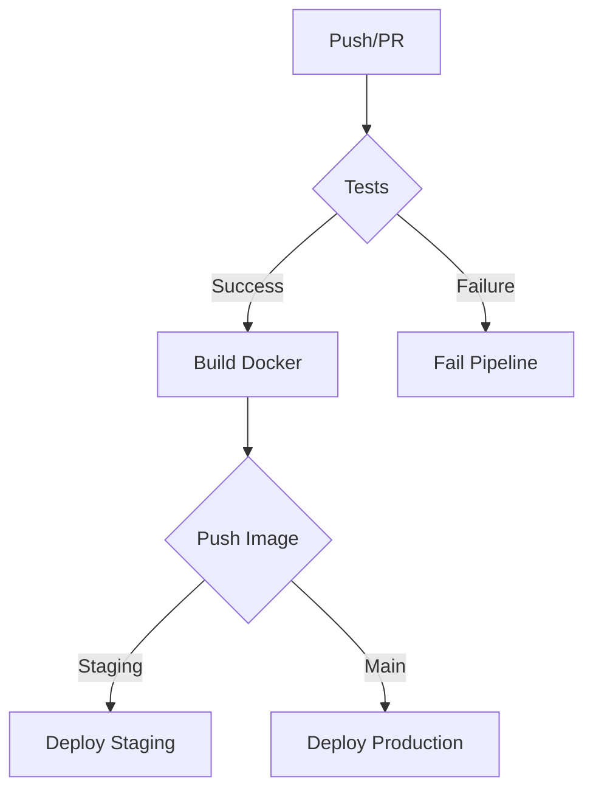

# Documentação de CI/CD e Containerização
## Projeto Node.js API - Gerenciamento de Produtos

### Equipe
- Bruna Cardoso
- Carlos Rosa
- Gabriel Teixeira
- Gabriel Zamboni
- Mateus Thibes

## 1. Pipeline de CI/CD

### 1.1 Visão Geral
O pipeline de CI/CD implementado utiliza GitHub Actions para automatizar todo o processo de desenvolvimento, desde os testes até o deploy em produção.

### 1.2 Componentes do Pipeline

#### 1.2.1 Testes (CI)
- **Trigger**: Pull Requests para `main` e `staging`
- **Ambiente**: Ubuntu Latest
- **Passos**:
  1. Checkout do código
  2. Setup do Node.js 18.x
  3. Instalação de dependências (`npm ci`)
  4. Execução dos testes (`npm test`)

#### 1.2.2 Build e Push (CD)
- **Trigger**: Push para `main` e `staging`
- **Dependência**: Sucesso dos testes
- **Passos**:
  1. Setup do Docker Buildx
  2. Login no DockerHub
  3. Build da imagem Docker
  4. Push da imagem com tags:
     - `latest`
     - SHA do commit
     - `staging` (apenas para branch staging)

#### 1.2.3 Deploy
- **Ambiente de Staging**:
  - Trigger: Merge na branch `staging`
  - Configuração via `docker-compose.staging.yml`
  - Porta: 3001
  - MongoDB: 27018

- **Ambiente de Produção**:
  - Trigger: Merge na branch `main`
  - Configuração via `docker-compose.production.yml`
  - Porta: 3002
  - MongoDB: 27019
  - Replicação: 2 instâncias

### 1.3 Fluxo de Trabalho


## 2. Estratégia de Containerização

### 2.1 Arquitetura de Containers

#### 2.1.1 Serviços
- **API Node.js**
  - Base: Node.js 18 Alpine
  - Multi-stage build
  - Otimizado para produção
  - Health checks

- **MongoDB**
  - Versão: Latest
  - Volumes persistentes
  - Configurações específicas por ambiente

#### 2.1.2 Redes
- Rede isolada por ambiente
- Bridge network para comunicação entre containers
- Portas expostas configuráveis

### 2.2 Estratégias de Deploy

#### 2.2.1 Desenvolvimento
- Hot-reload para desenvolvimento
- Volumes montados para código fonte
- Logs em tempo real

#### 2.2.2 Staging
- Imagem otimizada
- Logging estruturado
- Monitoramento básico

#### 2.2.3 Produção
- Alta disponibilidade (2 réplicas)
- Rolling updates
- Health checks
- Logging avançado

### 2.3 Benefícios da Containerização

1. **Consistência**
   - Ambiente idêntico em todos os estágios
   - Eliminação de "funciona na minha máquina"
   - Versionamento de dependências

2. **Isolamento**
   - Serviços independentes
   - Segurança aprimorada
   - Recursos isolados

3. **Escalabilidade**
   - Fácil replicação de serviços
   - Balanceamento de carga
   - Alta disponibilidade

4. **Portabilidade**
   - Deploy em qualquer ambiente
   - Migração simplificada
   - Independência de infraestrutura

## 3. Configuração e Execução

### 3.1 Configuração do Ambiente

#### 3.1.1 Variáveis de Ambiente
```env
# Exemplo de .env.production
NODE_ENV=production
PROD_PORT=3002
PROD_MONGO_URI=mongodb://mongodb:27017/nodejs-api-prod
LOG_LEVEL=error
```

#### 3.1.2 Docker Compose
```yaml
# Exemplo de docker-compose.production.yml
version: '3.8'
services:
  api:
    image: ${DOCKERHUB_USERNAME}/nodejs-api:latest
    ports:
      - "3002:3002"
    environment:
      - NODE_ENV=production
    deploy:
      replicas: 2
```

### 3.2 Comandos de Execução

#### 3.2.1 Desenvolvimento
```bash
# Iniciar ambiente de desenvolvimento
docker-compose up -d

# Ver logs
docker-compose logs -f
```

#### 3.2.2 Staging
```bash
# Deploy em staging
docker-compose -f docker-compose.staging.yml up -d
```

#### 3.2.3 Produção
```bash
# Deploy em produção
docker-compose -f docker-compose.production.yml up -d
```

## 4. Monitoramento e Logs

### 4.1 Estratégia de Logging
- Winston para logging estruturado
- Níveis diferentes por ambiente
- Rotação de logs
- Agregação centralizada

### 4.2 Métricas
- Health checks
- Latência de API
- Uso de recursos
- Erros e exceções

## 5. Segurança

### 5.1 Práticas Implementadas
- Secrets no GitHub Actions
- Variáveis de ambiente por ambiente
- Imagens Docker otimizadas
- Scanning de vulnerabilidades

### 5.2 Controles de Acesso
- RBAC para ambientes
- Tokens de acesso
- Auditoria de ações

## 6. Evidências de Execução

### 6.1 Pipeline CI/CD
[Inserir prints do GitHub Actions]
- Execução dos testes
- Build da imagem
- Deploy em staging/produção

### 6.2 Containers
[Inserir prints do Docker]
- Containers em execução
- Logs dos serviços
- Métricas de performance

### 6.3 APIs
[Inserir prints das APIs]
- Endpoints funcionando
- Respostas corretas
- Performance adequada

## 7. Conclusão

A implementação do pipeline CI/CD e a estratégia de containerização proporcionam:

1. **Automação**
   - Deploy automatizado
   - Testes contínuos
   - Build otimizado

2. **Qualidade**
   - Ambiente consistente
   - Testes automatizados
   - Code review facilitado

3. **Velocidade**
   - Deploy rápido
   - Rollback fácil
   - Escalabilidade simples

4. **Manutenibilidade**
   - Código organizado
   - Documentação clara
   - Processos padronizados 